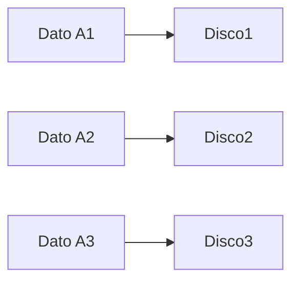
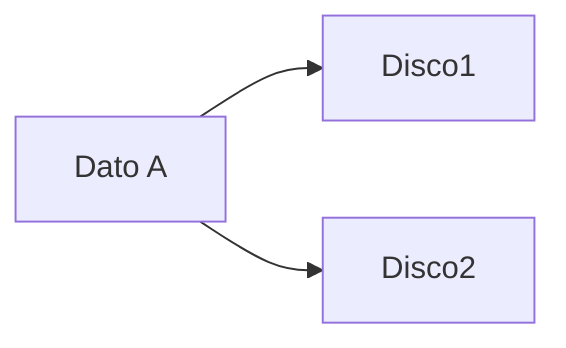
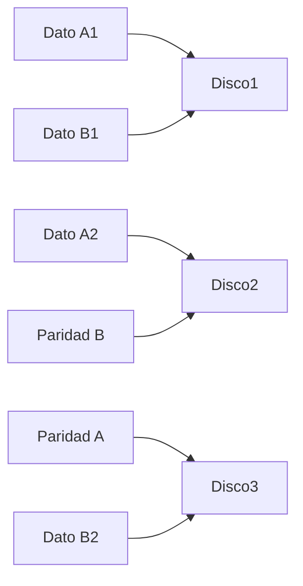
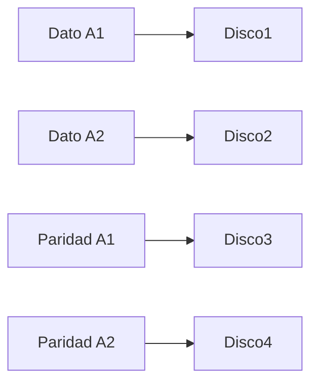
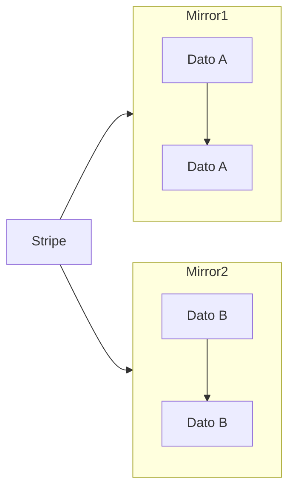
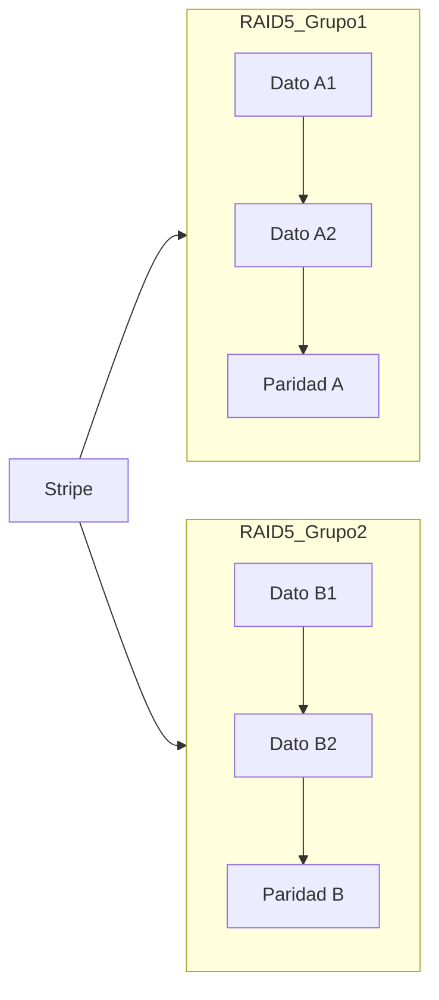

# Utilizando múltiples discos

Un arreglo de discos (RAID, por sus siglas en inglés: Redundant Array of Independent Disks) es una tecnología que combina múltiples discos duros en una sola unidad lógica para mejorar el rendimiento, la redundancia o ambas. RAID se utiliza comúnmente en servidores y sistemas de almacenamiento para proteger datos contra fallos de hardware.

## Tipos de RAID

### RAID 0 (Striping)
**Explicación**:  
Divide los datos en bloques ("stripes") y los distribuye entre múltiples discos sin redundancia.  
**Diagrama**:


**Ventajas**:  
- **Alto rendimiento** (lectura/escritura en paralelo).  
- **Máximo almacenamiento útil** (suma de todos los discos).  

**Desventajas**:  
- **Sin tolerancia a fallos** (si un disco falla, se pierden todos los datos).  
- **Riesgo alto** para datos críticos.

---

### RAID 1 (Mirroring)  
**Explicación**:  
Crea una copia exacta (espejo) de los datos en dos o más discos.  
**Diagrama**:


**Ventajas**:  
- **Redundancia total** (un disco puede fallar sin pérdida de datos).  
- **Rápida recuperación** (reemplazo sencillo del disco dañado).  

**Desventajas**:  
- **Alto costo** (50% de almacenamiento útil; ej: 2x1TB = 1TB usable).  
- **Rendimiento moderado** (escritura más lenta al duplicar datos).

---

### RAID 5 (Striping + Paridad Distribuida)  
**Explicación**:  
Combina "striping" con paridad distribuida. La paridad se reparte entre todos los discos.  
**Mínimo**: 3 discos.  
**Diagrama**:


**Ventajas**:  
- **Tolerancia a fallos** (soporta 1 disco dañado).  
- **Eficiencia de almacenamiento** (ej: 3 discos → 66% útil; 4 discos → 75% útil).  

**Desventajas**:  
- **Lento en escrituras** (cálculo de paridad).  
- **Riesgo durante reconstrucción** (si falla otro disco, se pierden datos).

---

### RAID 6 (Striping + Doble Paridad) 
**Explicación**:  
Similar a RAID 5, pero con **dos bloques de paridad** por cada "stripe".  
**Mínimo**: 4 discos.  
**Diagrama**:


**Ventajas**:  
- **Alta tolerancia a fallos** (soporta 2 discos dañados simultáneos).  
- **Ideal para discos grandes o entornos críticos**.  

**Desventajas**:  
- **Escrituras muy lentas** (cálculo de doble paridad).  
- **Mayor costo** (ej: 4 discos → 50% útil; 6 discos → 66% útil).

---

### RAID 10 (RAID 1+0: Mirroring + Striping)  
**Explicación**:  
Combina RAID 1 (espejo) y RAID 0 (striping). Primero crea espejos, luego divide los datos.  
**Mínimo**: 4 discos (en pares).  
**Diagrama**:


**Ventajas**:  
- **Alto rendimiento** (lectura/escritura rápida).  
- **Tolerancia a fallos múltiples** (si no fallan ambos discos de un mismo espejo).  

**Desventajas**:  
- **Costo elevado** (50% de almacenamiento útil).  
- **Complejidad** (requiere mínimo 4 discos).

---

### RAID 50 (RAID 5+0: Striping de Grupos RAID 5)
**Explicación**:  
Combina múltiples grupos de RAID 5 en un solo RAID 0.  
**Mínimo**: 6 discos (2 grupos de RAID 5 con 3 discos cada uno).  
**Diagrama**:


**Ventajas**:  
- **Alto rendimiento y capacidad** (mejor que RAID 5 individual).  
- **Tolerancia a fallos** (1 disco por grupo RAID 5 puede fallar).  

**Desventajas**:  
- **Costo alto** (requiere mínimo 6 discos).  
- **Complejidad de gestión**.

## Implementación de RAID en Linux

1. **Instalar herramientas necesarias**:
   ```bash
   sudo apt update
   sudo apt install mdadm
   ```

2. **Crear un arreglo RAID**:
   - Por ejemplo, para RAID 1:
     ```bash
     sudo mdadm --create \
        --verbose /dev/md0 --level=1 \
        --raid-devices=2 /dev/sdX /dev/sdY
     ```

3. **Verificar el estado del RAID**:
   ```bash
   cat /proc/mdstat
   ```

4. **Guardar la configuración**:
   ```bash
   sudo mdadm --detail --scan >> /etc/mdadm/mdadm.conf
   ```

5. **Formatear y montar el RAID**:
   ```bash
   sudo mkfs.ext4 /dev/md0
   sudo mount /dev/md0 /mnt
   ```

Con estos pasos, puedes configurar y gestionar arreglos RAID en Linux de manera eficiente.