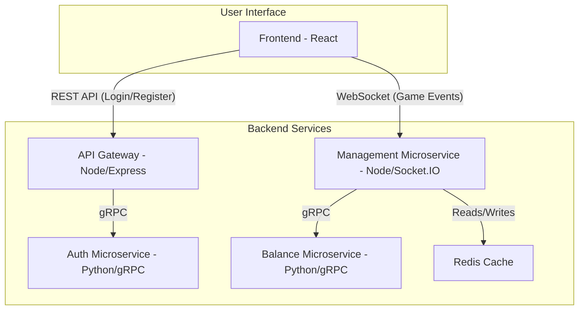

# Ruleta en Línea

Este proyecto es una aplicación web de ruleta de casino multijugador en tiempo real, construida sobre una arquitectura de microservicios. Permite a los usuarios registrarse, iniciar sesión, gestionar su saldo y realizar apuestas en una ruleta virtual interactiva, todo sincronizado en vivo.

##  Características Principales

- **Juego en Tiempo Real**: La comunicación se realiza mediante WebSockets para una experiencia de juego fluida y sincronizada entre todos los jugadores.
- **Arquitectura de Microservicios**: Lógica de negocio desacoplada en servicios independientes (autenticación, saldo, gestión del juego) que se comunican a través de gRPC para alta eficiencia.
- **Autenticación Segura**: Sistema completo de registro e inicio de sesión de usuarios.
- **Gestión de Saldos Dedicada**: Un microservicio exclusivo maneja las transacciones de saldo de los usuarios de forma segura y aislada.
- **Interfaz de Usuario Interactiva**: Frontend moderno y reactivo construido con React, TypeScript y Vite.
- **Containerización Completa**: Todo el proyecto está containerizado con Docker y orquestado con Docker Compose para un despliegiegue y desarrollo simplificado.

##  Stack Tecnológico

| Componente                | Tecnologías                                                                 |
| ------------------------- | --------------------------------------------------------------------------- |
| **Contenedores**          | Docker, Docker Compose                                                      |
| **Frontend**              | React, TypeScript, Vite, Jotai, TanStack Query, Socket.IO Client            |
| **Backend (API Gateway)** | Node.js, Express, gRPC                                                      |
| **Microservicios**        | Node.js (Management), Python (Auth, Balance), gRPC, Socket.IO               |
| **Comunicación**          | REST, gRPC, WebSockets                                                      |
| **Base de Datos (Cache)** | Redis (para sesiones de usuario y estado del juego en tiempo real)          |
| **Base de Datos (Core)**  | SQL (modelo definido en [`backend/data_model.sql`](backend/data_model.sql)) |

##  Arquitectura del Sistema

El sistema está compuesto por un frontend, un API Gateway que actúa como punto de entrada, y varios microservicios especializados que manejan la lógica de negocio.



- **Frontend**: La interfaz de usuario con la que interactúan los jugadores. Se comunica vía REST con el API Gateway para la autenticación y mantiene una conexión WebSocket persistente con el `management_microservice` para el juego.
- **API Gateway (`backend/`)**: El único punto de entrada para las solicitudes HTTP del frontend. Delega las tareas de autenticación a los microservicios correspondientes.
- **Management Microservice (`management_microservice/`)**: El corazón del juego. Gestiona el ciclo de la ruleta ([`GameLoop.ts`](management_microservice/GameLoop.ts)), las conexiones de los jugadores ([`SocketService.ts`](management_microservice/services/SocketService.ts)), las apuestas y los resultados.
- **Auth & Balance Microservices**: Servicios gRPC escritos en Python que manejan responsabilidades específicas: autenticación de usuarios y gestión de saldos, respectivamente.

##  Instalación y Ejecución Local

Para ejecutar este proyecto en tu máquina local, es necesario tener Docker y Docker Compose instalados.

### Prerrequisitos

- [Docker](https://www.docker.com/get-started)
- [Docker Compose](https://docs.docker.com/compose/install/)

### Pasos para la Ejecución

1.  **Clonar el repositorio**

    ```bash
    git clone <URL_DEL_REPOSITORIO>
    cd roulette
    ```

2.  **Construir e iniciar los contenedores**
    Este comando leerá el archivo [`docker-compose.yml`](docker-compose.yml), construirá las imágenes de cada servicio y los iniciará en segundo plano.

    ```bash
    docker-compose up --build -d
    ```

3.  **Verificar que los servicios estén corriendo**
    Puedes ver el estado de todos los contenedores con:

    ```bash
    docker-compose ps
    ```

    Deberías ver todos los servicios (`frontend`, `backend`, `auth_microservice`, etc.) con el estado `Up`.

4.  **Acceder a la aplicación**
    Una vez que todos los contenedores estén en funcionamiento, abre tu navegador y navega a:
    [http://localhost:3210](http://localhost:3210)

##  Despliegue en Producción

La arquitectura basada en Docker y Docker Compose simplifica enormemente el despliegue en un entorno de producción. Todos los servicios están diseñados para ejecutarse como contenedores aislados.

1.  **Preparación del Servidor**:

    - Asegúrate de que tu servidor de producción tenga **Docker** y **Docker Compose** instalados.
    - Clona el repositorio en el servidor.

2.  **Configuración de Entorno (Opcional)**:

    - Si necesitas variables de entorno específicas para producción (ej. credenciales de base de datos, secretos), puedes crear un archivo `.env` en la raíz del proyecto. Docker Compose lo cargará automáticamente.

3.  **Lanzamiento de la Aplicación**:

    - Utiliza el mismo comando que en el desarrollo local para construir e iniciar todos los servicios en modo detached (en segundo plano):
      ```bash
      docker-compose up --build -d
      ```
    - Esto iniciará todos los microservicios y el frontend. El frontend, en particular, se construye para producción y es servido eficientemente por **PM2** dentro de su contenedor Docker, como se define en [`frontend/ecosystem.config.cjs`](frontend/ecosystem.config.cjs).

4.  **Configuración de un Reverse Proxy (Recomendado)**:

    - La aplicación frontend estará disponible en el puerto `3210` del host. Para un entorno de producción real, se recomienda configurar un reverse proxy como **Nginx** o **Caddy** para:
      - Gestionar los certificados SSL/TLS (HTTPS).
      - Mapear tu dominio (ej. `casino.tudominio.com`) al servicio del frontend (`localhost:3210`).
      - Manejar el tráfico de WebSockets de manera eficiente.

5.  **Monitoreo y Mantenimiento**:
    - Puedes verificar el estado de tus contenedores en cualquier momento con `docker-compose ps`.
    - Para ver los logs de un servicio específico (por ejemplo, `management_microservice`):
      ```bash
      docker-compose logs -f management_microservice
      ```

### Detener la Aplicación

Para detener y eliminar todos los contenedores y redes creadas por Docker Compose, ejecuta:

```bash
docker-compose down
```

##  Estructura del Proyecto

```
.
├── auth_microservice/      # Microservicio de autenticación (Python, gRPC)
├── backend/                # API Gateway (Node.js, Express)
├── balance_microservice/   # Microservicio de saldos (Python, gRPC)
├── frontend/               # Aplicación de cliente (React, TypeScript)
├── management_microservice/  # Microservicio de lógica de juego (Node.js, Socket.IO)
├── docker-compose.yml      # Orquestador de todos los servicios
├── package.json            # Dependencias y scripts a nivel raíz
└── README.md               # Este archivo
```